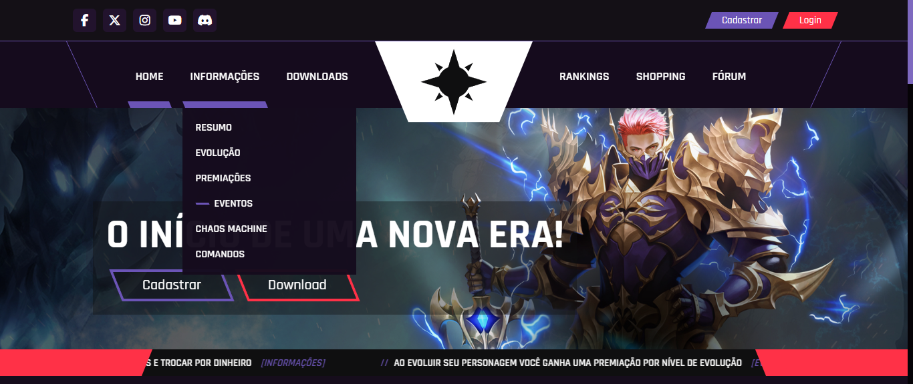

# Empire Theme - MU Online Theme

## **Screenshots**

### **Home**
<h1></h1>
<h1></h1>
<h1></h1>

### **Informações**
<h1></h1>

### **Downloads**
<h1></h1>

### **Rankings**
<h1></h1>

### **Cadastrar**
<h1></h1>

### **Login**
<h1></h1>

### **Minha Conta**
<h1></h1>

### **Personagens**
<h1></h1>

### **Coins**
<h1></h1>

### **VIP**
<h1></h1>

### **Segurança**
<h1></h1>

### **Coins**
<h1></h1>

### **Notícias**
<h1></h1>

### **Notícia**
<h1></h1>

### **Componentes**

**Menu Lateral** *(Sidebar Menu)*
<h1></h1>

**Menu Suspenso** *(Dropdown Menu)*
<h1></h1>